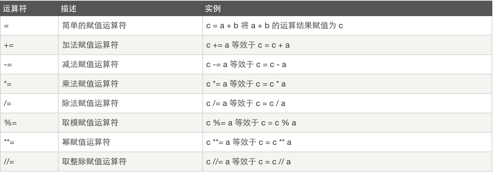

# 基本语法2

python中有哪些基本的数据类型呢？数字int、浮点数float、字符串str、布尔值bool、列表list、元组tuple、字典dict等。

## 基本运算符
运算根据最终获得的值不同，通常可分为两类。即结果为具体值的值和结果为布尔值的值。
结果为具体值的运算我们称之为算术运算和赋值运算；
结果为布尔值的运算我们称之为逻辑运算；

### 算术运算符


### 赋值运算符


### 逻辑运算符


## 基本数据类型
1.1 整数
 Python可以处理任意大小的整数，例如：1，100，-80，0，等等。

 计算机由于使用二进制，所以有时候用十六进制表示整数比较方便，十六进制用0x前缀和0-9，a-f表示，例如：0xff00，0x15a7b4，等等。

  1.2 浮点数
 浮点数也就是小数，之所以称为浮点数，是因为按照科学记数法表示时，一个浮点数的小数点位置是可变的，比如，1.23x105和12.3x104是完全相等的。浮点数可以用数学写法，如1.2，3.141，-7.356，等等。

 对于很大或很小的浮点数，必须用科学计数法表示，把10用e替代，1.23x105就是1.23e5，或者12.3e8，0.000012可以写成1.2e-5，等等。

 整数和浮点数在计算机内部存储的方式是不同的，整数运算永远是精确的，而浮点数运算则可能会有四舍五入的误差。

1.3 字符串
字符串是以单引号'或双引号"括起来的任意文本，比如'abc'，"xyz"等等。字符串'abc'只有a，b，c这3个字符。

 转义字符\可以转义很多字符，比如\n表示换行，\t表示制表符，字符\本身也要转义，所以\表示的字符就是\。

  1.4 布尔值
 布尔值和布尔代数的表示完全一致，一个布尔值只有True、False两种值。在Python中，可以直接用True、False表示布尔值（请注意大小写），也可以通过布尔运算计算出来：

```
3 > 2
True
3 > 5
False
```
布尔值可以使用and、or和not运算。

and运算是与运算，只有所有都为True，and运算结果才是True：

```
True and False
False
3 > 2 and 10 > 9
True
```

or运算是或运算，只要其中有一个为True，or运算结果就是True：
```
True or False
True
False or False
False
```

not运算是非运算，它是一个单目运算符，把True变成False，False变成True：
```
not True
False
not False
True
not 5 > 2
False
```

布尔值经常用在条件判断中，比如：
```
if age >= 18:
    print('adult')
else:
    print('teenager')
```
1.5 空值None
空值是Python里一个特殊的值，用None表示。None不能理解为0，因为0是有意义的，而None是一个特殊的空值
```
age = None
print(age)
```
